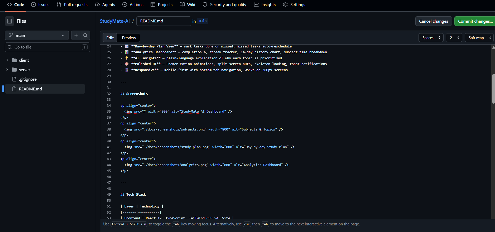
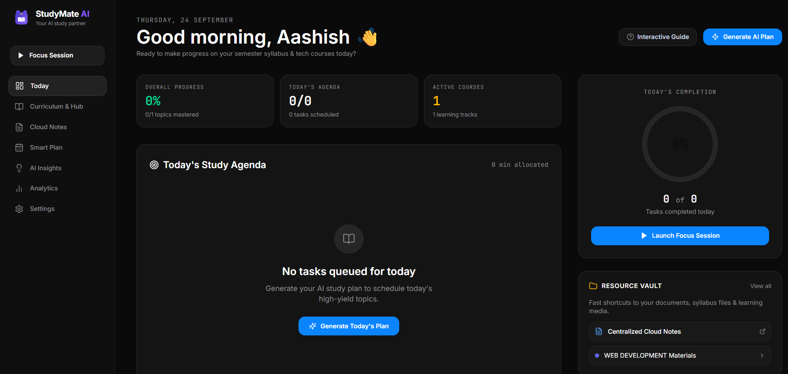
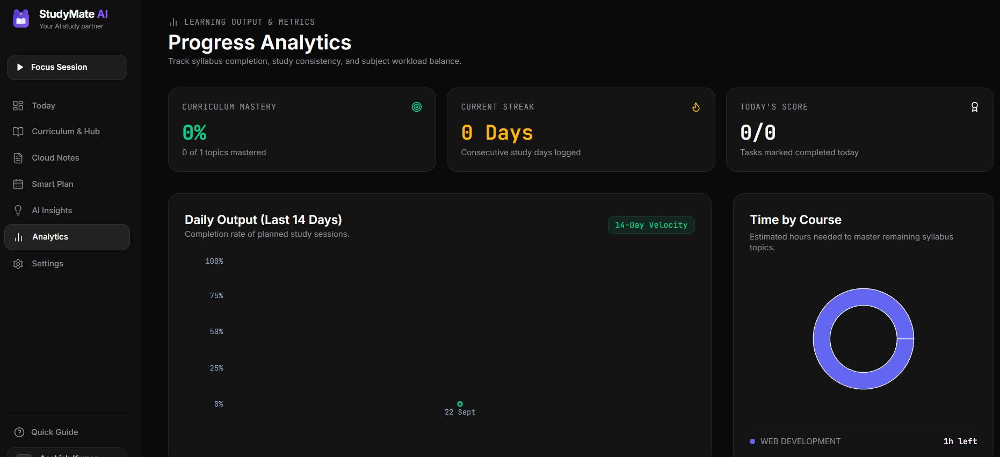

# StudyMate AI 📚 (v2.0)

> A production-grade, AI-powered academic curriculum & study planner for university students — engineered with React 19, Node.js, Express, MongoDB Atlas, and a pedagogical prerequisite scheduling algorithm.

**Live Application:** [study-mate-ai-wheat-seven.vercel.app](https://study-mate-ai-wheat-seven.vercel.app/) | **API Service:** [studymate-ai-me50.onrender.com](https://studymate-ai-me50.onrender.com)

     

---

## What It Does

StudyMate AI helps students manage multiple subjects and upcoming exams by generating a personalised, day-by-day study schedule — automatically prioritising the topics you're least confident about and the exams closest to you.

### Key Features

- 🔐 **JWT Authentication** — signup, login, secure token refresh with HTTP-only cookies
- 📚 **Subject & Topic Tracker** — add subjects with exam dates, topics with confidence ratings (1–5) and estimated time
- 🤖 **AI Scoring Algorithm** — generates a prioritised study plan using:
  ```
  Priority Score = urgency × (6 − confidence) × topicWeight
  ```
  where urgency = 1 / days until exam
- 📅 **Day-by-day Plan View** — mark tasks done or missed; missed tasks auto-reschedule
- 📊 **Analytics Dashboard** — completion %, streak tracker, 14-day history chart, subject time breakdown
- 💡 **AI Insights** — plain-language explanation of why each topic is prioritised
- 🎨 **Polished UI** — Framer Motion animations, split-screen auth, skeleton loading, toast notifications
- 📱 **Responsive** — mobile-first with bottom tab navigation, works on 360px screens

---

## Screenshots

<p align="center">
  
</p>
<p align="center">
  
</p>
<p align="center">
  
</p>

Try the [live StudyMate AI demo](https://study-mate-ai-wheat-seven.vercel.app/).

---

## Tech Stack

| Layer | Technology |
|-------|-----------|
| **Frontend** | React 19, TypeScript (Strict), Vite 6, Tailwind CSS v4 |
| **Routing & Code-Splitting** | React Router v7 with route-level `React.lazy` + `Suspense` |
| **Animations** | Framer Motion (page transitions, roadmaps, modals) |
| **Icons** | Lucide React |
| **Forms & Validation** | React Hook Form + Zod v3 |
| **Data Visualization** | Recharts v3 |
| **Backend API** | Node.js, Express 5 |
| **Database** | MongoDB Atlas, Mongoose v9 |
| **Authentication** | JWT (Access + Refresh tokens with HTTP-only cookies), bcrypt |
| **Deployment** | Vercel (Frontend SPA) + Render (Backend Web Service) |

---

## Performance & Bundle Optimization

In v2.0, the client bundle was optimized via route-based code-splitting and vendor manual chunk division:

```
dist/index.html                           2.01 kB │ gzip:  0.86 kB
dist/assets/index-Bxyg0x1I.js           298.82 kB │ gzip: 96.21 kB  (Reduced from 999 kB!)
dist/assets/vendor-charts.js            376.96 kB │ gzip: 110.08 kB
dist/assets/vendor-motion.js            129.61 kB │ gzip: 42.75 kB
dist/assets/vendor-forms.js              84.86 kB │ gzip: 23.56 kB
dist/assets/vendor-icons.js              30.07 kB │ gzip:  6.58 kB
Individual Lazy Route Chunks:             4–34 kB
```

---

## The Cognitive AI Algorithm

Each pending topic receives a real-time **Pedagogical Priority Score**:

$$\text{Priority Score} = \text{Urgency} \times (6 - \text{Confidence}) \times \text{Unit Factor} \times \text{Topic Weight}$$

Where:
- $\text{Urgency} = \frac{1}{\max(\text{daysUntilExam}, 1)}$ — Closer exams generate higher urgency.
- $\text{Confidence} = 1 \dots 5$ — Lower student confidence yields higher priority multiplier ($6 - \text{confidence}$).
- $\text{Unit Factor} = \frac{1}{\text{unitNumber}}$ — Enforces foundational prerequisite progression (Unit 1 scheduled before Unit 4).
- $\text{Topic Weight} = \frac{\text{estimatedMinutes}}{\text{totalSubjectMinutes}}$.

### Why Deterministic Algorithmic Scheduling?
- **100% Offline & Reliable**: Zero external LLM API latency, zero token costs, and 0% hallucination risk.
- **Explainable AI**: The scheduling decision for any topic on any day can be mathematically verified and explained directly to the student.

---

## Project Structure

```
StudyMate-AI/
├── server/                      # Express 5 API
│   ├── src/
│   │   ├── controllers/         # Auth, Subject, Plan, Dashboard
│   │   ├── models/              # User, Subject, StudyPlan (Mongoose)
│   │   ├── routes/              # RESTful API routes
│   │   ├── middlewares/         # JWT auth, express-validator, CORS regex
│   │   ├── services/
│   │   │   └── study-planner.js # ← Pedagogical AI Engine
│   │   └── utils/               # ApiError, ApiResponse, asyncHandler, syllabus-parser.js
│   └── package.json
└── client/                      # React 19 SPA (Vite)
    ├── src/
    │   ├── pages/               # Lazy-loaded route views
    │   │   ├── auth/            # Login, Signup (Split-screen)
    │   │   ├── DashboardPage    # Focus Ring + Daily Agenda
    │   │   ├── SubjectsPage     # Folder Explorer & Grid views
    │   │   ├── SubjectDetailPage# Curriculum Unit checklist, Vault, Cloud Notes
    │   │   ├── StudyPlanPage    # Day-by-Day schedule & Mountain Roadmap
    │   │   ├── NotesPage        # Centralized Cloud Notes Vault
    │   │   ├── InsightsPage     # Pedagogical AI explanations
    │   │   └── AnalyticsPage    # Recharts metrics
    │   ├── components/          # Reusable UI components
    │   │   ├── CurriculumFolderTree.tsx   # Degree -> Semester -> Subject -> Unit explorer
    │   │   ├── LearningRoadmap.tsx        # Mountain Expedition Quest Trail
    │   │   ├── InlineDocViewerModal.tsx   # On-Site Drive/PDF viewer
    │   │   ├── SyllabusParserModal.tsx    # OCR/PDF syllabus parser
    │   │   ├── FocusPlayerModal.tsx       # Pomodoro focus player
    │   │   ├── InteractiveTutorialModal.tsx# v2 Feature Tour & Guide
    │   │   └── Modal.tsx / EmptyState.tsx
    │   ├── context/             # AuthContext, ToastContext, ConfirmContext, ThemeContext
    │   └── lib/                 # Axios client, error handling, client syllabus parser
    └── package.json
```

---

## Running Locally

### Prerequisites
- Node.js 18+
- MongoDB instance (Local or [MongoDB Atlas](https://cloud.mongodb.com))

### 1. Clone & Setup
```bash
git clone https://github.com/iaashishk/StudyMate-AI.git
cd StudyMate-AI
```

### 2. Configure Server Environment
Create `server/.env`:
```env
PORT=5000
MONGODB_URI=mongodb+srv://<username>:<password>@cluster0.xxx.mongodb.net/studymate-ai
ACCESS_TOKEN_SECRET=your_access_token_secret_here
REFRESH_TOKEN_SECRET=your_refresh_token_secret_here
CORS_ORIGIN=http://localhost:5173,http://127.0.0.1:5173
```

### 3. Start Backend
```bash
cd server
npm install
npm run dev
# → API running on http://localhost:5000
```

### 4. Start Frontend
```bash
cd ../client
npm install
npm run dev
# → Client running on http://localhost:5173
```

---

## Deployment

| Service | Platform | Root Directory | Configuration |
|---------|----------|---------------|---------------|
| **Frontend** | **Vercel** | `client/` | `VITE_API_URL=https://studymate-ai-me50.onrender.com/api` |
| **Backend** | **Render** | `server/` | Build: `npm install`, Start: `node src/index.js` |
| **Database** | **MongoDB Atlas** | — | M0 Free Tier with network access enabled |

---

## Author

**Aashish Kumar** — MCA Student (AI/ML)  
[GitHub](https://github.com/iaashishk) • [LinkedIn](https://www.linkedin.com/in/aashish-k-b53778261/)
